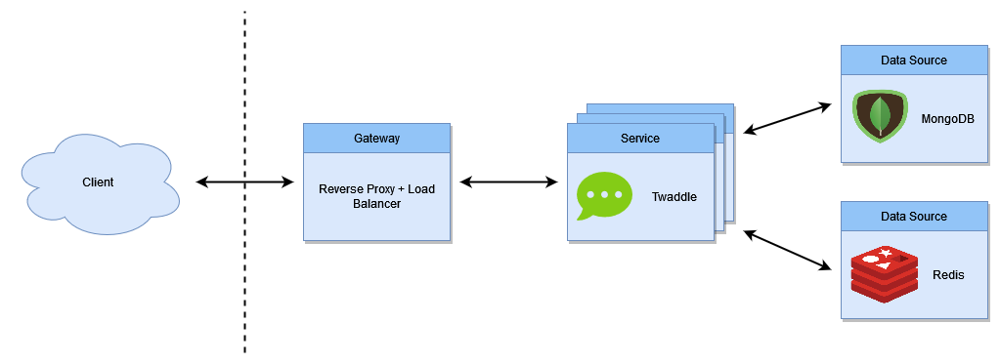

# Twaddle API

> Real time messenger and communication platform.

## Table of contents

- [Introduction](#introduction)
- [Architecture](#architecture)
  - [RESTful API](#restful-api)
  - [Web Socket API](#web-socket-api)
- [Configuration](#configuration)
  - [Envrionment Variables](#environment-variables)
  - [Environment Files](#environment-files)
- [Deployment](#deployment)
  - [Standalone operation](#standalone-operation)
  - [Cloud operation](#cloud-operation)
- [License](#license)
  - [Forbidden](#forbidden)

## Introduction

Messenger with user management for mutual communication exchange in real time.
This project does not serve to replace existing messengers from production,
but rather to understand communication processes in the area of messaging.

## Architecture

The communication platform has a monolithic structure. Nevertheless, the application
is architecturally developed in such a way that horizontal scaling and the associated
load balancing is possible. In a productive environment, an upstream gateway consisting
of reverse proxy and load balancer can be assumed.

The Twaddle Service provides two API interfaces, an HTTP RESTful interface and a Web
Sockets interface. In both cases, communication runs via the gateway. To enable horizontal
scaling, data must be stored in a common data source as an alternative to process memory.
The in-memory data structure storage [Redis](https://redis.io/) is used for this. Redis is
used to save temporary sessions and states, and is used in particular for scaled web socket
communication. In addition to Redis, a [MongoDB](https://www.mongodb.com/) instance is also
used for reasons of data persistence. While Redis acts as a message broker and temporary
storage, this database persists data.



### RESTful API

The RESTful interface is used to exchange static data such as user profiles or access data.
The communication is stateless based on the [HTTP/1.1](https://datatracker.ietf.org/doc/html/rfc2616/)
protocol. The resources and endpoints are documented by the self-service documentation provided
by the service itself. See `/docs` of the service instance for details.

### Web Socket API

A web socket interface is used for reactive tasks such as real-time communication. This is based on
the [WebSocket](https://datatracker.ietf.org/doc/html/rfc6455) protocol or, based on it, on the
[Socket.IO](https://github.com/socketio/socket.io-protocol) protocol. The resources and events
are documented by the self-service documentation provided by the service itself. See `/docs` of the
service instance for details.

## Configuration

In principle, the service can be fully configured via environment variables. These can be given to
the service via the system environment when called or via an environment file. With regard to the
configuration, it should be mentioned that the service works with three different configuration
profiles, `development`, `test` and `production`, and an additional default profile.
According to these profiles, the appropriate environment file is also loaded.

### Environment variables

The following variables are service parameters and affect the way it works.

**NOTE**: Unless otherwise specified, relative paths are always relative to the current working directory,
hence the directory in which the process is started.

| Variable                 | Description                                            | Required |
| ------------------------ | ------------------------------------------------------ | -------- |
| LOGGER_LEVEL             | Logging level to use during runtime                    | false    |
| LOGGER_FILENAME          | Optional file to which the logs are also written       | false    |
| DATABASE_URI             | URI of the MongoDB database used as primary data store | true     |
| CACHE_URI                | URI of the Redis instance used as secondary data store | true     |
| SECURITY_JWT_PUBLIC_KEY  | Path of the public key file for the JWT signing        | true     |
| SECURITY_JWT_PRIVATE_KEY | Path of the private key file for the JWT signing       | true     |
| SECURITY_JWT_ISSUER      | Identifier of the JWT issuer                           | true     |
| SECURITY_JWT_EXPIRES     | Validity period of a access token in seconds           | false    |
| SECURITY_TICKET_EXPIRES  | Validity period of a ticket in seconds                 | false    |

The following environment variables are not used directly by the Twaddle service, but by the
underlying system infrastructure such as the application server. Please note that only the
service-specific environment variables can be loaded from an environment file, but not the
following variables that affect the system infrastructure.

| Variable | Description                                                                 | Required |
| -------- | --------------------------------------------------------------------------- | -------- |
| NODE_ENV | Sets the environment profile, based on which the environment file is loaded | false    |
| PORT     | Sets the port of the underlying application server                          | false    |

### Environment files

It is possible to load the environment variables from a file. Environment files with the following
signature are always loaded: `.env` and `.env.<PROFILE>`. Possible configuration profiles are
`development`, `test` and `production`. The standard file `.env` should not contain any sensitive
information since it is included in the VCS, while the profile-specific file `.env.<PROFILE>` is
generally not included in the VCS and is therefore suitable for setting sensitive and profile
specific environment variables. The above variables are to be listed inside of the environment
file as key-value pairs per line, separated by an equals sign.

Environment files can be loaded from two locations, from the current working directory or from
the `resources` directory of the application. The default and the profile-specific file are
searched for in each of the two locations. If files are found in one or both locations, conflicts
can arise if the same environment variable is set in multiple files. In this case, the environment
variables are preferably set in the following order:

- `<CURRENT WORKDIR>/.env.<PROFILE>`
- `<APPLICATION ROOT>/resources/.env.<PROFILE>`
- `<CURRENT WORKDIR>/.env`
- `<APPLICATION ROOT>/resources/.env`

Values of higher-ordered paths have higher priority and "override" values of lower-ordered paths. This
means that profile-specific files always take precedence over default files, and files from the current
working directory always take precedence over files from the `resources` directory.

## Deployment

The service can basically be deployed in two ways: In standalone mode as a direct installation on the
server or on the cloud as a container.

### Standalone operation

Standalone operation requires a JavaScript runtime environment and thus a [Node.js](https://nodejs.org/en/)
installation. In version `1.x.x`, the Twaddle Platform requires a minimum Nodejs version of `16.x.x`. A runtime
version of the application must first be built. In addition to a JavaScript runtime environment, the build
tool [npm](https://www.npmjs.com/) is also required for this.

First, all dependencies are loaded from the package registry via npm. The dependencies are needed partly for
transpiling an executable version and partly for runtime operation.

```sh
$ npm run install
```

After that, a runtime version will be built.

```sh
$ npm run build
```

If an executable version is available, it can easily be started with the following command.

```sh
$ npm run start
```

For a successful start, the application, especially the external data sources, must also be configured.
See the configuration section above.

### Cloud operation

In addition to the standalone version, it is possible to start the application in a container. This has
the advantage that no Node.js installation is required. To do this, either an existing image must be loaded
from a registry, or a new Docker image of the application must be created.

A docker image can be created based on the attached dockerfile with the following command.

```sh
$ docker build -t twaddle/api:latest .
```

The result is a docker image which was stored in the local registry under the name `twaddle/api:latest`.
Depending on the orchestration system, the image can now be started in the form of a container. In its
simplest form, a container is created with the following command.

```sh
$ docker run -p <PORT>:3000/tcp -v <VOLUME>:/usr/local/bin/twaddle/api/resources:ro --name twaddle-api twaddle/api:latest
```

In contrast to standalone operation, the application in a container no longer has access to the project files.
Any assets such as certificates or environment files that were stored in the `resources` folder must therefore be
mounted in the form of a volume under the container path `/usr/local/bin/twaddle/api/resources`, because they are not
included into the Docker image. Of course, the placeholder must be replaced with the name of a volume that contains the
contents of the `resources` folder. In addition, an external port must be set which is bound to the internal port.

## License

Copyright (c) 2022 0x1C1B

Permission is hereby granted, free of charge, to any person obtaining a copy
of this software and associated documentation files (the "Software"), to deal
in the Software without restriction, including without limitation the rights
to use, copy, modify, merge, publish, distribute, sublicense, and/or sell
copies of the Software, and to permit persons to whom the Software is
furnished to do so, subject to the following conditions:

The above copyright notice and this permission notice shall be included in all
copies or substantial portions of the Software.

THE SOFTWARE IS PROVIDED "AS IS", WITHOUT WARRANTY OF ANY KIND, EXPRESS OR
IMPLIED, INCLUDING BUT NOT LIMITED TO THE WARRANTIES OF MERCHANTABILITY,
FITNESS FOR A PARTICULAR PURPOSE AND NONINFRINGEMENT. IN NO EVENT SHALL THE
AUTHORS OR COPYRIGHT HOLDERS BE LIABLE FOR ANY CLAIM, DAMAGES OR OTHER
LIABILITY, WHETHER IN AN ACTION OF CONTRACT, TORT OR OTHERWISE, ARISING FROM,
OUT OF OR IN CONNECTION WITH THE SOFTWARE OR THE USE OR OTHER DEALINGS IN THE
SOFTWARE.

[MIT License](https://opensource.org/licenses/MIT) or [LICENSE](LICENSE) for
more details.

### Forbidden

**Hold Liable**: Software is provided without warranty and the software
author/license owner cannot be held liable for damages.
